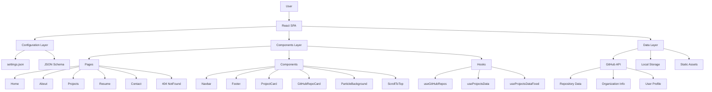
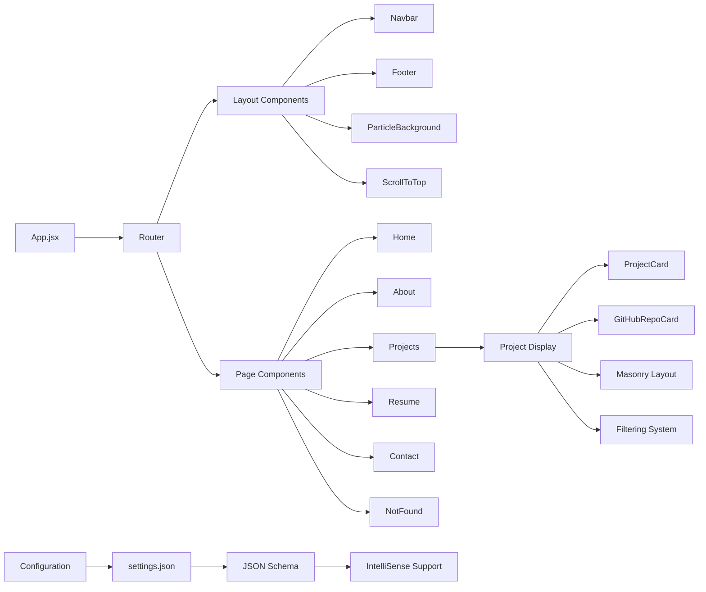
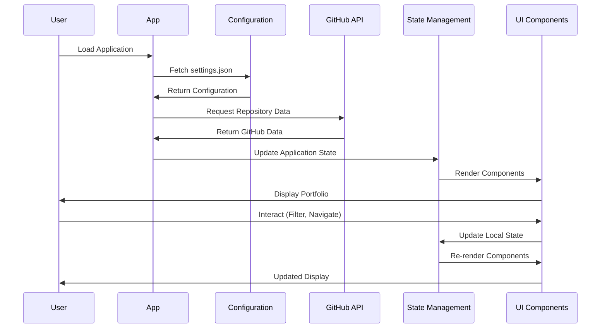
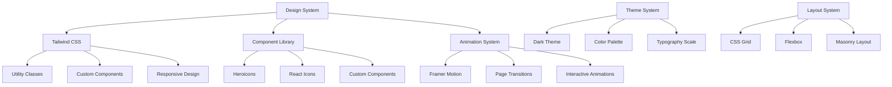
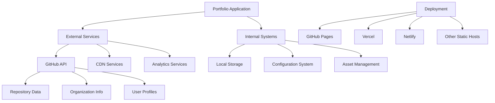
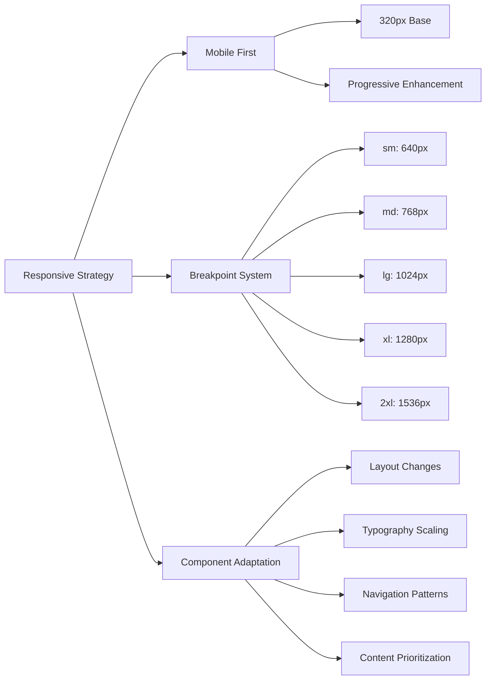
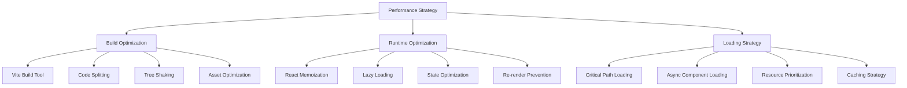
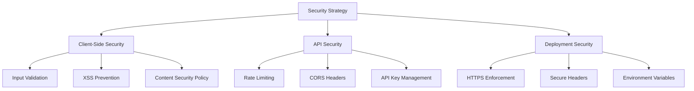
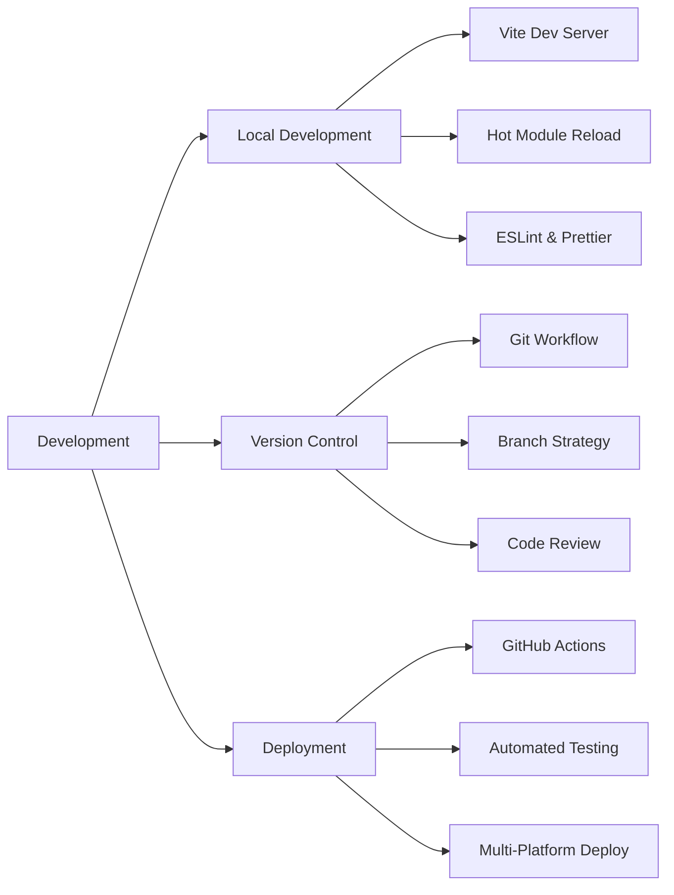

# Portfolio Architecture Documentation

## 🎯 Overview

This portfolio is a modern, configurable React-based single-page application (SPA) that dynamically fetches and displays GitHub repositories while providing comprehensive personal and professional information. The architecture follows a component-based design with centralized configuration management and responsive design principles.

## 🏗️ System Architecture



### System Architecture Elements:
1. **User Interface Layer**: React SPA with responsive design
2. **Configuration Layer**: JSON-based settings with schema validation
3. **Component Layer**: Reusable UI components and pages
4. **Data Layer**: External APIs, local storage, and static assets
5. **GitHub Integration**: Dynamic repository fetching and display
6. **Routing System**: Client-side navigation with React Router
7. **State Management**: React hooks and context for local state
8. **Asset Management**: Static files and dynamic content delivery

## 🔧 Component Architecture



### Component Architecture Elements:
1. **App.jsx**: Root component with routing setup
2. **Layout Components**: Persistent UI elements (Navbar, Footer)
3. **Page Components**: Route-specific content containers
4. **Project Display System**: Dynamic repository showcase
5. **Configuration System**: JSON-based customization
6. **Schema Validation**: Type-safe configuration editing
7. **Responsive Design**: Mobile-first component structure

## 📊 Data Flow Architecture



### Data Flow Elements:
1. **Initial Load**: Configuration and GitHub data fetching
2. **State Updates**: Dynamic content updates and filtering
3. **User Interactions**: Navigation, filtering, and preferences
4. **Re-rendering**: Efficient component updates
5. **Error Handling**: Fallback modes and error boundaries
6. **Performance Optimization**: Memoization and lazy loading

## 🎨 UI/UX Architecture



### UI/UX Architecture Elements:
1. **Design System**: Consistent visual language with Tailwind CSS
2. **Component Library**: Icon systems and reusable components
3. **Animation System**: Smooth transitions with Framer Motion
4. **Theme System**: Dark mode with cohesive color schemes
5. **Layout System**: Responsive grid and flexbox layouts
6. **Typography**: Hierarchical text styling and readability
7. **Interactive Elements**: Hover states and user feedback

## 🔌 Integration Architecture



### Integration Architecture Elements:
1. **GitHub API Integration**: Dynamic repository and profile data
2. **CDN Services**: Optimized asset delivery and caching
3. **Local Storage**: User preferences and temporary data
4. **Configuration Management**: JSON-based settings system
5. **Deployment Options**: Multiple hosting platform support
6. **Analytics Integration**: User behavior tracking (optional)
7. **Performance Monitoring**: Loading and interaction metrics

## 📱 Responsive Design Architecture



### Responsive Design Elements:
1. **Mobile-First Approach**: Progressive enhancement from small screens
2. **Tailwind Breakpoints**: Standardized responsive design system
3. **Component Adaptation**: Context-aware UI adjustments
4. **Layout Flexibility**: Grid and flexbox responsive patterns
5. **Typography Scaling**: Readable text across all devices
6. **Navigation Patterns**: Adaptive menu and interaction styles
7. **Content Prioritization**: Important content visibility management

## 🚀 Performance Architecture



### Performance Architecture Elements:
1. **Build Optimization**: Vite-powered fast bundling and optimization
2. **Code Splitting**: Lazy loading of non-critical components
3. **Tree Shaking**: Elimination of unused code and dependencies
4. **Asset Optimization**: Image compression and format optimization
5. **React Optimization**: Memoization and efficient re-rendering
6. **Loading Strategy**: Progressive and prioritized content delivery
7. **Caching Strategy**: Browser and CDN caching optimization

## 🔒 Security Architecture



### Security Architecture Elements:
1. **Client-Side Security**: Input validation and XSS prevention
2. **API Security**: Rate limiting and secure API communication
3. **Content Security Policy**: Protection against malicious content
4. **HTTPS Enforcement**: Encrypted data transmission
5. **Environment Variables**: Secure configuration management
6. **Secure Headers**: HTTP security headers implementation
7. **CORS Configuration**: Cross-origin request security

## 🔄 Development Workflow Architecture



### Development Workflow Elements:
1. **Local Development**: Fast development server with HMR
2. **Code Quality**: ESLint and Prettier for consistent code
3. **Version Control**: Git-based workflow with branching strategy
4. **Automated Deployment**: CI/CD pipeline with GitHub Actions
5. **Testing Strategy**: Automated testing and validation
6. **Multi-Platform Support**: Deployment to various hosting services
7. **Code Review Process**: Quality assurance and knowledge sharing

## 🏛️ Project Structure

```
📁 VKrishna04.github.io/
├── 📁 public/                 # Static assets and configuration
│   ├── 📄 settings.json       # Main configuration file
│   ├── 📄 settings.schema.json # JSON schema for IntelliSense
│   ├── 📄 resume.pdf          # Resume file (optional)
│   └── 📄 404.html           # Custom 404 page
├── 📁 src/                    # Source code
│   ├── 📁 components/         # Reusable UI components
│   │   ├── 📁 Footer/         # Site footer component
│   │   ├── 📁 GitHubRepoCard/ # GitHub repository display
│   │   ├── 📁 Navbar/         # Navigation bar component
│   │   ├── 📁 ParticleBackground/ # Animated background
│   │   ├── 📁 ProjectCard/    # Project display card
│   │   └── 📁 ScrollToTop/    # Scroll to top functionality
│   ├── 📁 hooks/              # Custom React hooks
│   │   ├── 📄 useGitHubRepos.js # GitHub API integration
│   │   ├── 📄 useProjectsData.js # Project data management
│   │   └── 📄 useProjectsDataFixed.js # Fixed project data
│   ├── 📁 pages/              # Page components
│   │   ├── 📄 About.jsx       # About page
│   │   ├── 📄 Contact.jsx     # Contact page
│   │   ├── 📄 Home.jsx        # Landing page
│   │   ├── 📄 NotFound.jsx    # 404 error page
│   │   ├── 📄 Projects.jsx    # Projects showcase
│   │   ├── 📄 ProjectsStatic.jsx # Static projects page
│   │   ├── 📄 ProjectsTemp.jsx # Temporary projects page
│   │   ├── 📄 Resume.jsx      # Resume page
│   │   └── 📄 Resume_new.jsx  # New resume format
│   ├── 📁 utils/              # Utility functions
│   │   └── 📄 darkReaderDisable.js # Dark reader compatibility
│   ├── 📄 App.css             # Global styles
│   ├── 📄 App.jsx             # Root application component
│   ├── 📄 index.css           # Base styles and Tailwind imports
│   ├── 📄 main.jsx            # Application entry point
│   └── 📄 styles.css          # Additional styles
├── 📁 docs/                   # Documentation
│   ├── 📄 SETTINGS_GUIDE.md   # Configuration guide
│   ├── 📄 SETTINGS_REFERENCE.md # Settings reference
│   └── 📄 PROJECTS_STATIC_DYNAMIC.md # Project modes
├── 📄 ARCHITECTURE.md         # This file
├── 📄 LICENSE.md              # License information
├── 📄 README.md               # Project overview
├── 📄 eslint.config.js        # ESLint configuration
├── 📄 package.json            # Dependencies and scripts
├── 📄 postcss.config.js       # PostCSS configuration
├── 📄 tailwind.config.js      # Tailwind CSS configuration
└── 📄 vite.config.js          # Vite build configuration
```

## 🎯 Design Decisions

### 1. **React with Vite**
- **Rationale**: Fast development experience with hot module replacement
- **Benefits**: Quick builds, modern ES modules, optimized production bundles
- **Trade-offs**: Newer ecosystem compared to Create React App

### 2. **JSON-Based Configuration**
- **Rationale**: Non-technical users can customize without code changes
- **Benefits**: Schema validation, IntelliSense support, version control friendly
- **Trade-offs**: Limited to JSON data types, no complex logic

### 3. **Tailwind CSS Framework**
- **Rationale**: Utility-first approach for rapid UI development
- **Benefits**: Consistent design system, small bundle size, responsive utilities
- **Trade-offs**: Learning curve, potential class bloat

### 4. **Component-Based Architecture**
- **Rationale**: Reusable, maintainable, and testable code structure
- **Benefits**: Separation of concerns, easy testing, scalable development
- **Trade-offs**: Initial overhead for simple components

### 5. **GitHub API Integration**
- **Rationale**: Dynamic content that stays current automatically
- **Benefits**: Always up-to-date project information, reduced maintenance
- **Trade-offs**: API rate limits, network dependency

### 6. **Static Site Generation**
- **Rationale**: Fast loading, excellent SEO, simple deployment
- **Benefits**: CDN cacheable, secure, cost-effective hosting
- **Trade-offs**: No server-side processing, build-time data

## 🔮 Future Architectural Considerations

### Scalability Enhancements
1. **Micro-Frontend Architecture**: Split into smaller, independent applications
2. **Server-Side Rendering**: Next.js migration for improved SEO and performance
3. **API Gateway**: Centralized API management and caching layer
4. **Database Integration**: User-generated content and analytics storage

### Performance Improvements
1. **Service Worker**: Offline functionality and advanced caching
2. **WebAssembly**: Performance-critical computations
3. **CDN Integration**: Global content delivery and edge computing
4. **Image Optimization**: Next-gen formats and adaptive serving

### Feature Expansions
1. **Content Management**: Admin interface for non-technical updates
2. **Internationalization**: Multi-language support
3. **Analytics Integration**: User behavior tracking and insights
4. **Authentication**: User accounts and personalized experiences

### Technology Upgrades
1. **React 19**: Concurrent features and improved suspense
2. **TypeScript**: Type safety and better developer experience
3. **GraphQL**: Efficient data fetching and caching
4. **Monorepo**: Shared components and utilities across projects

---

*This architecture documentation is maintained alongside the codebase and updated with significant architectural changes.*
