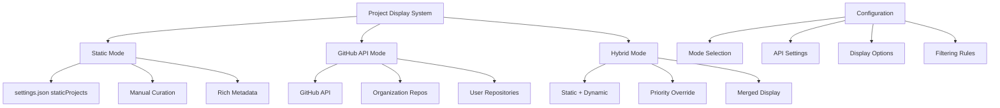
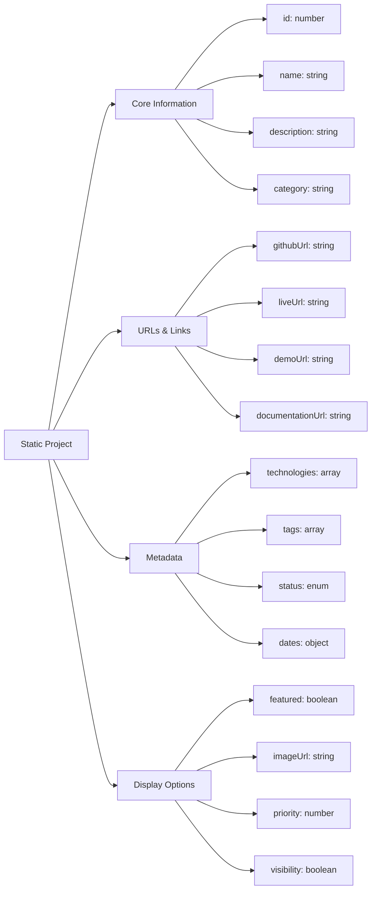
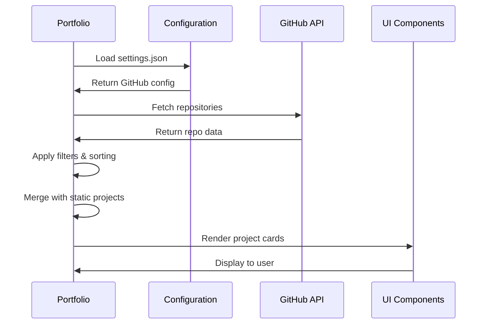
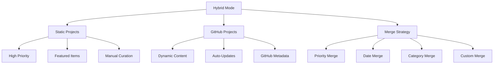
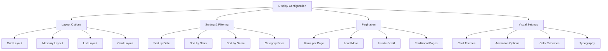

# Dynamic Projects Configuration Guide

## 🎯 Overview

This portfolio supports multiple project display modes that can be configured through `settings.json`, providing flexibility between static project definitions and dynamic GitHub API integration. This system allows for both curated project showcases and automated repository displays.

## 📊 Project Modes Architecture



### Project Mode Elements:
1. **Static Mode**: Manually curated projects with rich metadata
2. **GitHub API Mode**: Dynamic repository fetching from GitHub
3. **Hybrid Mode**: Combination of static and dynamic content
4. **Configuration Layer**: JSON-based mode and display settings
5. **Filtering System**: Include/exclude rules and sorting options
6. **Display Options**: Layout, pagination, and presentation settings
7. **Metadata Enhancement**: Technology icons, categories, and stats

## 🛠️ Configuration Modes

### 1. **Static Mode** (Manual Curation)
```json
{
  "projects": {
    "mode": "static",
    "staticProjects": [
      {
        "id": 1,
        "name": "Portfolio Website",
        "description": "Modern React portfolio with dynamic GitHub integration",
        "category": "Full Stack",
        "status": "Completed",
        "featured": true,
        "technologies": ["React", "Vite", "Tailwind CSS", "Framer Motion"],
        "githubUrl": "https://github.com/VKrishna04/VKrishna04.github.io",
        "liveUrl": "https://vkrishna04.github.io",
        "imageUrl": "/project-images/portfolio.png",
        "startDate": "2024-01-01",
        "endDate": "2024-03-15",
        "highlights": [
          "Responsive design with mobile-first approach",
          "Dynamic GitHub repository integration",
          "Comprehensive configuration system",
          "Advanced animation and interaction patterns"
        ],
        "stats": {
          "stars": 42,
          "forks": 15,
          "watchers": 8,
          "downloads": 1250
        }
      }
    ]
  }
}
```

### 2. **GitHub API Mode** (Dynamic Integration)
```json
{
  "projects": {
    "mode": "github",
    "github": {
      "type": "org",
      "username": "Life-Experimentalists",
      "apiUrl": "https://api.github.com/orgs/Life-Experimentalists/repos",
      "userAgent": "VKrishna04-Portfolio"
    },
    "ignore": [
      ".github",
      "VKrishna04.github.io",
      "private-config"
    ],
    "maxProjects": 20,
    "sortBy": "updated",
    "sortOrder": "desc",
    "showForks": false,
    "showPrivate": false
  }
}
```

### 3. **Hybrid Mode** (Best of Both Worlds)
```json
{
  "projects": {
    "mode": "hybrid",
    "staticProjects": [
      {
        "id": 1,
        "name": "Featured Project",
        "priority": 1,
        "overrideGithub": true
      }
    ],
    "github": {
      "type": "org",
      "username": "Life-Experimentalists"
    },
    "mergeStrategy": "priority",
    "maxTotal": 15
  }
}
```

## 🎨 Static Project Schema



### Static Project Schema Elements:
1. **Core Information**: Essential project details and description
2. **URLs & Links**: Various project-related links and resources
3. **Metadata**: Technologies, tags, status, and timeline information
4. **Display Options**: Visibility, priority, and presentation settings
5. **Statistics**: GitHub-style metrics and engagement data
6. **Rich Content**: Highlights, features, and detailed descriptions
7. **Media Assets**: Images, videos, and visual representations

### Complete Static Project Configuration

#### **Required Fields**
```json
{
  "id": 1,                           // Unique identifier
  "name": "Project Name",            // Display name
  "description": "Project overview", // Brief description
  "category": "Full Stack"           // Project category
}
```

#### **Development Information**
```json
{
  "status": "Completed",             // "Completed", "In Progress", "Planned", "Archived"
  "technologies": [                  // Technology stack
    "React", "Node.js", "MongoDB", "TypeScript"
  ],
  "startDate": "2024-01-01",        // ISO date string
  "endDate": "2024-03-15",          // null for ongoing projects
  "teamSize": 3,                    // Number of team members
  "role": "Full Stack Developer"    // Your role in the project
}
```

#### **Links and Resources**
```json
{
  "githubUrl": "https://github.com/user/repo",
  "liveUrl": "https://project.com",
  "demoUrl": "https://demo.project.com",
  "documentationUrl": "https://docs.project.com",
  "designUrl": "https://figma.com/design-link",
  "videoUrl": "https://youtube.com/watch?v=demo"
}
```

#### **Display and Media**
```json
{
  "featured": true,                 // Show in featured section
  "priority": 1,                    // Display order (1-10)
  "imageUrl": "/images/project.png", // Project thumbnail
  "gallery": [                      // Additional images
    "/images/screenshot1.png",
    "/images/screenshot2.png"
  ],
  "color": "#6366f1",               // Theme color
  "visibility": true                // Show/hide project
}
```

#### **Content and Features**
```json
{
  "highlights": [                   // Key features
    "Real-time collaboration",
    "Advanced authentication",
    "Responsive design"
  ],
  "challenges": [                   // Technical challenges solved
    "Scalable WebSocket architecture",
    "Complex state synchronization"
  ],
  "learnings": [                    // Skills gained
    "WebSocket implementation",
    "Redis for session management"
  ],
  "tags": [                         // Searchable tags
    "real-time", "collaboration", "saas"
  ]
}
```

#### **Statistics and Metrics**
```json
{
  "stats": {
    "stars": 42,                    // GitHub stars
    "forks": 15,                    // GitHub forks
    "watchers": 8,                  // GitHub watchers
    "downloads": 1250,              // Download count
    "users": 500,                   // Active users
    "uptime": "99.9%"              // Service uptime
  },
  "performance": {
    "loadTime": "1.2s",            // Page load time
    "lighthouse": 95,               // Lighthouse score
    "coverage": "85%"               // Test coverage
  }
}
```

## 🔗 GitHub API Integration



### GitHub API Integration Elements:
1. **Configuration Loading**: GitHub API settings from JSON
2. **Repository Fetching**: Dynamic data retrieval from GitHub
3. **Data Processing**: Filtering, sorting, and transformation
4. **Static Merging**: Combination with manually curated projects
5. **UI Rendering**: Component-based display system
6. **Error Handling**: Fallback modes and error boundaries
7. **Rate Limiting**: API usage optimization and caching

### GitHub Configuration Options

#### **Organization Mode**
```json
{
  "github": {
    "type": "org",
    "username": "Life-Experimentalists",
    "apiUrl": "https://api.github.com/orgs/Life-Experimentalists/repos",
    "userAgent": "Portfolio-v2024",
    "timeout": 10000,
    "retries": 3
  }
}
```

#### **User Mode**
```json
{
  "github": {
    "type": "user",
    "username": "VKrishna04",
    "apiUrl": "https://api.github.com/users/VKrishna04/repos",
    "includeForked": false,
    "includePrivate": false
  }
}
```

#### **Advanced Filtering**
```json
{
  "projects": {
    "ignore": [
      ".github",
      "config-repo",
      "private-notes"
    ],
    "include": [
      "important-project"
    ],
    "languages": [
      "JavaScript", "TypeScript", "Python"
    ],
    "minStars": 5,
    "maxAge": 365,
    "topics": [
      "portfolio", "web-development"
    ]
  }
}
```

## 🔄 Hybrid Mode Configuration



### Hybrid Mode Elements:
1. **Static Projects**: Manually curated high-priority projects
2. **GitHub Projects**: Dynamically fetched repository data
3. **Merge Strategies**: Various approaches to combining data sources
4. **Priority System**: Ordering and importance assignment
5. **Override Mechanism**: Static data takes precedence when needed
6. **Category Management**: Organized project grouping
7. **Display Limits**: Total project count and pagination

### Merge Strategy Options

#### **Priority-Based Merging**
```json
{
  "projects": {
    "mode": "hybrid",
    "mergeStrategy": "priority",
    "staticFirst": true,
    "maxStatic": 5,
    "maxGithub": 10,
    "maxTotal": 15
  }
}
```

#### **Date-Based Merging**
```json
{
  "projects": {
    "mode": "hybrid",
    "mergeStrategy": "date",
    "sortBy": "updated",
    "preserveStatic": true
  }
}
```

#### **Category-Based Merging**
```json
{
  "projects": {
    "mode": "hybrid",
    "mergeStrategy": "category",
    "categories": {
      "Featured": { "static": 3, "github": 2 },
      "Web Development": { "static": 2, "github": 5 },
      "Tools": { "static": 1, "github": 3 }
    }
  }
}
```

## 🎯 Project Categories and Technologies

### Predefined Categories
```json
{
  "categories": [
    "Full Stack",
    "Frontend",
    "Backend",
    "Mobile",
    "Desktop",
    "AI/ML",
    "DevOps",
    "Tools",
    "Libraries",
    "Templates"
  ]
}
```

### Technology Icons Mapping
```json
{
  "technologyIcons": {
    "React": { "icon": "FaReact", "color": "#61dafb" },
    "Vue": { "icon": "FaVuejs", "color": "#4fc08d" },
    "Angular": { "icon": "FaAngular", "color": "#dd0031" },
    "Node.js": { "icon": "FaNodeJs", "color": "#339933" },
    "Python": { "icon": "FaPython", "color": "#3776ab" },
    "TypeScript": { "icon": "SiTypescript", "color": "#3178c6" },
    "JavaScript": { "icon": "FaJs", "color": "#f7df1e" },
    "Docker": { "icon": "FaDocker", "color": "#2496ed" },
    "MongoDB": { "icon": "SiMongodb", "color": "#47a248" },
    "PostgreSQL": { "icon": "SiPostgresql", "color": "#336791" }
  }
}
```

## 🚀 How to Add New Projects

### Static Mode Project Addition

#### **Step 1: Open Configuration**
```bash
# Open settings.json in your editor
code public/settings.json
```

#### **Step 2: Add Project Object**
```json
{
  "projects": {
    "staticProjects": [
      // ... existing projects
      {
        "id": 8,
        "name": "E-commerce Platform",
        "description": "Full-stack e-commerce solution with real-time inventory management and payment processing.",
        "category": "Full Stack",
        "status": "Completed",
        "featured": true,
        "priority": 2,
        "startDate": "2024-01-15",
        "endDate": "2024-06-30",
        "technologies": [
          "Next.js", "TypeScript", "Prisma", "PostgreSQL",
          "Stripe", "Redis", "Docker"
        ],
        "githubUrl": "https://github.com/VKrishna04/ecommerce-platform",
        "liveUrl": "https://shop.vkrishna04.me",
        "demoUrl": "https://demo.shop.vkrishna04.me",
        "documentationUrl": "https://docs.shop.vkrishna04.me",
        "imageUrl": "/project-images/ecommerce.png",
        "highlights": [
          "Real-time inventory tracking",
          "Multi-vendor support",
          "Advanced search and filtering",
          "Secure payment processing",
          "Admin dashboard with analytics"
        ],
        "tags": [
          "ecommerce", "nextjs", "typescript", "stripe", "real-time"
        ],
        "stats": {
          "stars": 67,
          "forks": 23,
          "users": 1500,
          "uptime": "99.8%"
        }
      }
    ]
  }
}
```

#### **Step 3: Validate and Save**
- VS Code will validate JSON syntax automatically
- Schema validation will catch configuration errors
- Save file to see changes immediately

### GitHub Mode Repository Management

#### **Including Specific Repositories**
```json
{
  "projects": {
    "mode": "github",
    "include": [
      "important-project",
      "featured-tool",
      "documentation-site"
    ]
  }
}
```

#### **Advanced Filtering Rules**
```json
{
  "projects": {
    "filters": {
      "languages": ["JavaScript", "TypeScript", "Python"],
      "topics": ["web", "api", "tool"],
      "minStars": 10,
      "maxAge": 365,
      "excludeForked": true,
      "excludeArchived": true,
      "requireDescription": true,
      "requireReadme": true
    }
  }
}
```

## 📊 Display Configuration



### Display Configuration Elements:
1. **Layout Options**: Various project card arrangements
2. **Sorting & Filtering**: User-controlled content organization
3. **Pagination**: Content loading and navigation strategies
4. **Visual Settings**: Themes, animations, and styling options
5. **Responsive Design**: Mobile and desktop optimizations
6. **Accessibility**: Screen reader and keyboard navigation support
7. **Performance**: Lazy loading and optimization settings

### Layout and Display Settings
```json
{
  "display": {
    "layout": "masonry",              // "grid", "masonry", "list"
    "itemsPerPage": 12,               // Projects per page
    "showCategories": true,           // Category filtering
    "showTechnologies": true,         // Technology tags
    "showStats": true,                // GitHub statistics
    "animationStyle": "fade",         // "fade", "slide", "scale"
    "cardStyle": "modern",            // "modern", "classic", "minimal"
    "showLoadMore": true,             // Load more button
    "enableSearch": true,             // Search functionality
    "enableFiltering": true           // Filter controls
  }
}
```

## 🔧 Advanced Configuration

### Environment-Specific Settings
```json
{
  "environment": {
    "development": {
      "github": {
        "mockData": true,
        "fallbackMode": true
      }
    },
    "production": {
      "github": {
        "caching": true,
        "rateLimitHandling": true
      }
    }
  }
}
```

### Performance Optimization
```json
{
  "performance": {
    "caching": {
      "enabled": true,
      "duration": 3600,
      "strategy": "localStorage"
    },
    "lazy": {
      "images": true,
      "components": true,
      "threshold": 0.1
    },
    "prefetch": {
      "enabled": true,
      "priority": ["featured", "recent"]
    }
  }
}
```

### Analytics and Tracking
```json
{
  "analytics": {
    "trackViews": true,
    "trackClicks": true,
    "trackDownloads": true,
    "provider": "custom",
    "events": {
      "projectView": "project_viewed",
      "linkClick": "external_link_clicked",
      "filterUsed": "filter_applied"
    }
  }
}
```

## 🛠️ Troubleshooting

### Common Issues and Solutions

#### **GitHub API Rate Limiting**
```json
{
  "github": {
    "rateLimitHandling": true,
    "fallbackMode": true,
    "cacheEnabled": true,
    "cacheDuration": 3600
  }
}
```

#### **Missing Project Data**
```json
{
  "validation": {
    "required": ["name", "description"],
    "fallbacks": {
      "description": "No description available",
      "imageUrl": "/default-project.png"
    }
  }
}
```

#### **Display Issues**
```json
{
  "debug": {
    "showErrors": true,
    "logLevel": "warn",
    "showMissingData": true
  }
}
```

## 📚 Best Practices

### Project Organization
1. **Use consistent naming conventions** for project IDs and names
2. **Maintain category consistency** across all projects
3. **Include comprehensive descriptions** for better searchability
4. **Use high-quality images** for better visual appeal
5. **Keep technology lists accurate** and up-to-date

### Configuration Management
1. **Validate JSON syntax** before deploying
2. **Use version control** for settings.json
3. **Test configuration changes** in development
4. **Document custom modifications** for team members
5. **Regular backup** of configuration files

### Performance Considerations
1. **Optimize images** before adding to projects
2. **Limit total project count** for better performance
3. **Use caching** for GitHub API calls
4. **Implement lazy loading** for large project lists
5. **Monitor bundle size** impact of configurations

---

*This configuration guide is updated regularly to reflect new features and best practices.*
    "Multi-language support",
    "Admin analytics panel"
  ],
  "stats": {
    "stars": 45,
    "forks": 12,
    "watchers": 20,
    "issues": 3
  }
}
```

## 🎯 Project Categories

Recommended categories for consistent styling:
- `"Full Stack"`
- `"Frontend"`
- `"Backend"`
- `"Web App"`
- `"Mobile App"`
- `"AI/ML"`
- `"DevOps"`
- `"API"`
- `"Library"`
- `"Tool"`

## 🎨 Status Options

Available status values with color coding:
- `"Completed"` - Green badge
- `"In Progress"` - Yellow badge
- `"Planned"` - Gray badge
- `"On Hold"` - Red badge

## 📊 Technology Icons

The component automatically maps technology names to icons. Supported technologies include:

**Languages:** JavaScript, TypeScript, Python, Java, PHP, Go, Rust, Swift, Kotlin, Dart, HTML, CSS, C++, C, Ruby, Shell

**Frameworks:** React, Vue, Next.js, Node.js, Express

**Databases:** MongoDB, PostgreSQL, MySQL, Redis

**Tools:** Docker, AWS, Git, Tailwind CSS

## 🔄 Switching Between Modes

To switch from static to GitHub API mode:

1. Change `"mode": "static"` to `"mode": "github"`
2. Ensure your GitHub configuration is correct
3. The app will automatically fetch projects from GitHub API

To switch back to static mode:
1. Change `"mode": "github"` to `"mode": "static"`
2. Your static projects will be displayed

## 🎛️ Additional Configuration

### Filtering & Sorting
```json
{
  "projects": {
    "maxProjects": 15,
    "sortBy": "updated", // "updated", "created", "stars", "name"
    "sortOrder": "desc", // "desc", "asc"
    "showForks": false,
    "showPrivate": false
  }
}
```

### GitHub Ignore List
```json
{
  "projects": {
    "ignore": [
      "VKrishna04.github.io",
      ".github",
      "private-repo"
    ]
  }
}
```

## ✨ Features

Your dynamic projects page now includes:

- 🔍 **Search** - Search by name, description, category, or tags
- 🏷️ **Technology Filtering** - Filter by programming languages/technologies
- 📊 **Sorting Options** - Sort by name, date, or popularity
- 📱 **Responsive Design** - Works perfectly on all devices
- 🎨 **Consistent Styling** - Unified design for both static and GitHub projects
- 🔗 **Multiple Links** - GitHub, live demo, documentation links
- 📈 **Project Stats** - Stars, forks, views (if available)
- 🎯 **Project Status** - Visual indicators for project status
- ✨ **Smooth Animations** - Beautiful hover effects and transitions

## 🔄 Migration from ProjectsStatic

Your existing `ProjectsStatic.jsx` file has been preserved as a backup. The new `Projects.jsx` component now handles both modes dynamically, giving you the flexibility to:

1. Use curated static projects for a professional portfolio
2. Switch to live GitHub data when you want to showcase all repositories
3. Easily add new projects through configuration without code changes

This makes your portfolio much more maintainable and allows you to update project information quickly without touching any code!
