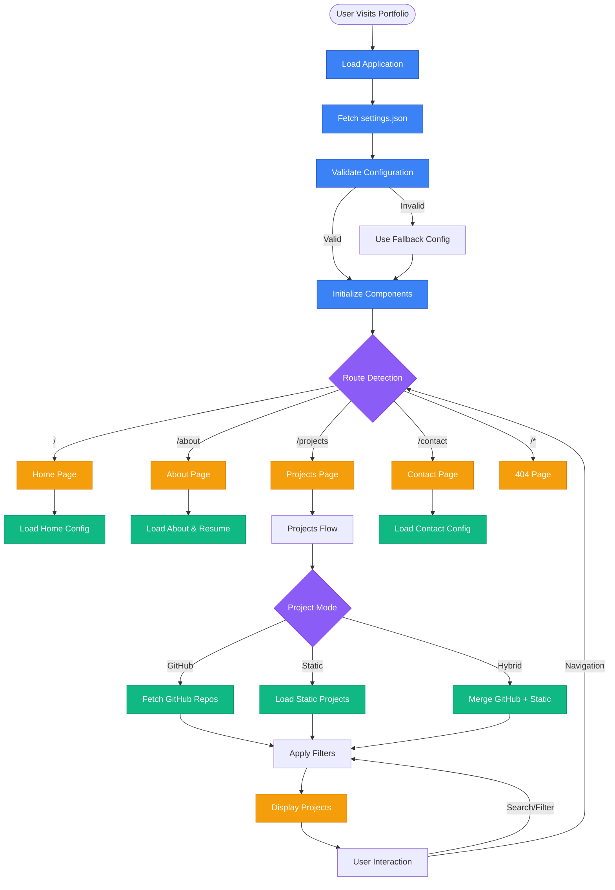
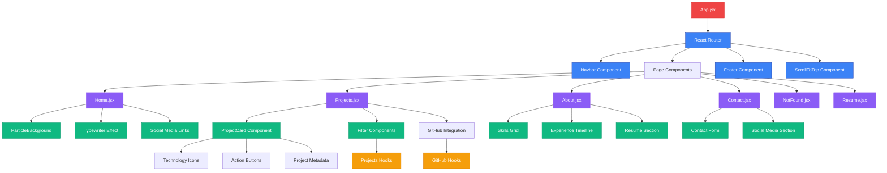
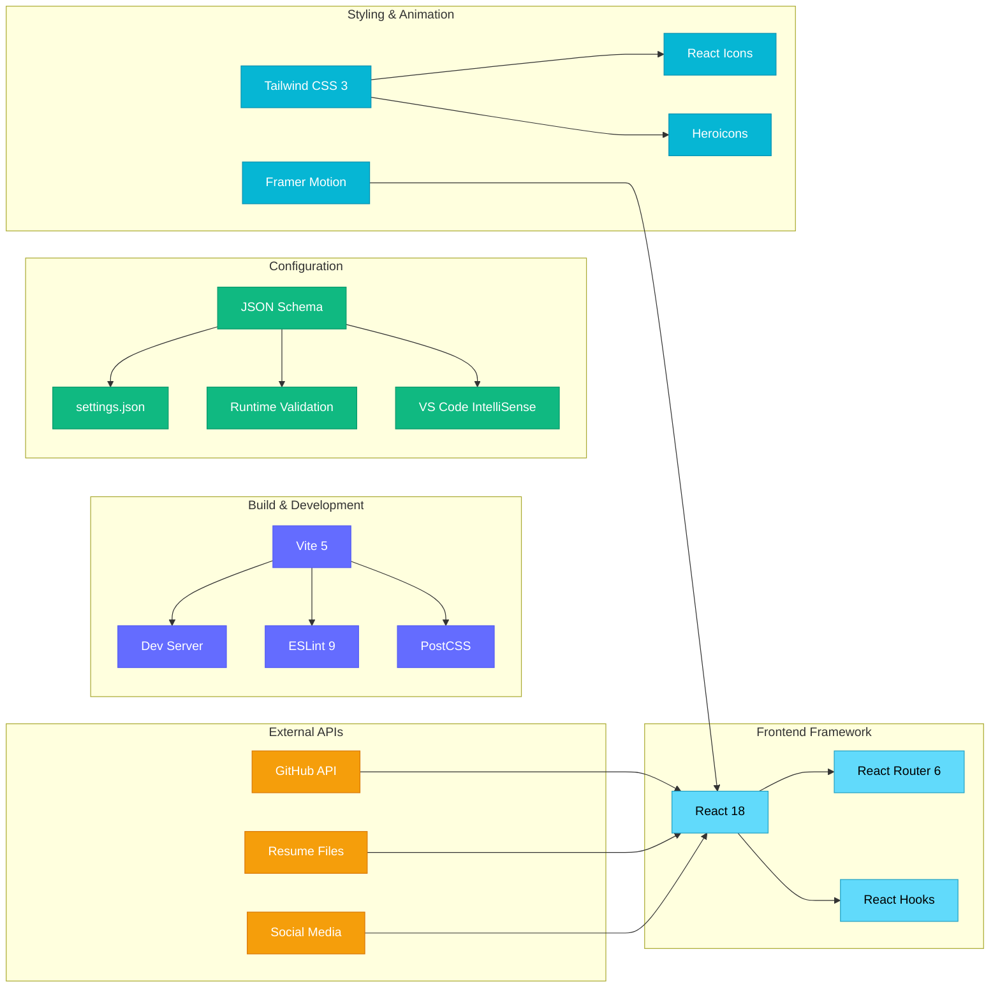
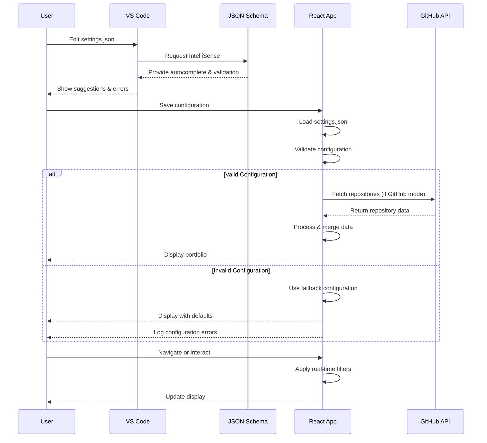

```mermaid
graph TB
    subgraph "Frontend Layer"
        React[React 18 SPA]
        Router[React Router]
        UI[Tailwind CSS UI]
        Animations[Framer Motion]
    end

    subgraph "Configuration System"
        Settings[settings.json]
        Schema[JSON Schema]
        Validation[Runtime Validation]
    end

    subgraph "Data Sources"
        GitHub[GitHub API]
        Static[Static Projects]
        Resume[Resume Files]
    end

    subgraph "Core Features"
        Projects[Projects Display]
        About[About Page]
        Contact[Contact Form]
        Home[Home Page]
    end

    React --> Router
    React --> UI
    React --> Animations
    React --> Projects
    React --> About
    React --> Contact
    React --> Home

    Settings --> Schema
    Settings --> Validation
    Settings --> Projects
    Settings --> Home
    Settings --> Contact

    GitHub --> Projects
    Static --> Projects
    Resume --> About

    classDef primary fill:#3b82f6,stroke:#1e40af,color:#fff
    classDef secondary fill:#8b5cf6,stroke:#7c3aed,color:#fff
    classDef data fill:#10b981,stroke:#059669,color:#fff
    classDef feature fill:#f59e0b,stroke:#d97706,color:#fff

    class React,Router,UI,Animations primary
    class Settings,Schema,Validation secondary
    class GitHub,Static,Resume data
    class Projects,About,Contact,Home feature
```

# Krishna GSVV Portfolio

A modern, responsive portfolio website built with React, Vite, and Tailwind CSS. Features dynamic GitHub repository fetching, beautiful animations, and a comprehensive configuration system that makes it fully customizable through a single JSON file.

## 🏗️ System Architecture Overview



## 🎯 Application Flow Diagram



## 🚀 Features

- **📱 Fully Responsive**: Perfect display on all devices with mobile-first design
- **🎨 Modern Design**: Dark theme with glassmorphism effects and smooth animations
- **⚙️ Completely Configurable**: Everything customizable through `settings.json` - no code changes needed
- **🔗 Dynamic GitHub Integration**: Automatically fetches and displays repositories from any GitHub organization or user
- **🎭 Beautiful Animations**: Powered by Framer Motion for fluid interactions
- **📊 Technology Recognition**: Displays relevant technology icons based on repository languages and topics
- **📄 Resume Integration**: Configurable resume download (local file or external link)
- **🌐 Social Media Integration**: Centralized social media configuration with per-section visibility
- **🎯 IntelliSense Support**: JSON Schema for better editing experience
- **🔍 SEO Optimized**: Proper meta tags and structured data
- **⚡ Fast Performance**: Optimized build with Vite for lightning-fast loading

## 📁 Project Structure



```mermaid
graph TD
    subgraph "Root Directory"
        Public[public/]
        Src[src/]
        Docs[docs/]
        Config[Config Files]
    end

    subgraph "Public Assets"
        Settings[settings.json]
        Schema[settings.schema.json]
        Resume[resume.pdf]
        NotFound[404.html]
    end

    subgraph "Source Code"
        Components[components/]
        Pages[pages/]
        Hooks[hooks/]
        Utils[utils/]
        Styles[styles/]
    end

    subgraph "Components Structure"
        Navbar[Navbar/]
        Footer[Footer/]
        ProjectCard[ProjectCard/]
        ParticlesBG[ParticleBackground/]
        ScrollTop[ScrollToTop/]
        GitHubCard[GitHubRepoCard/]
    end

    subgraph "Pages Structure"
        HomePage[Home.jsx]
        AboutPage[About.jsx]
        ProjectsPage[Projects.jsx]
        ContactPage[Contact.jsx]
        NotFoundPage[NotFound.jsx]
        ResumePage[Resume.jsx]
    end

    subgraph "Hooks & Utils"
        GitHubHook[useGitHubRepos.js]
        ProjectsHook[useProjectsData.js]
        DarkReader[darkReaderDisable.js]
    end

    Public --> Settings
    Public --> Schema
    Public --> Resume
    Public --> NotFound

    Src --> Components
    Src --> Pages
    Src --> Hooks
    Src --> Utils
    Src --> Styles

    Components --> Navbar
    Components --> Footer
    Components --> ProjectCard
    Components --> ParticlesBG
    Components --> ScrollTop
    Components --> GitHubCard

    Pages --> HomePage
    Pages --> AboutPage
    Pages --> ProjectsPage
    Pages --> ContactPage
    Pages --> NotFoundPage
    Pages --> ResumePage

    Hooks --> GitHubHook
    Hooks --> ProjectsHook
    Utils --> DarkReader

    classDef directory fill:#3b82f6,stroke:#1e40af,color:#fff
    classDef file fill:#10b981,stroke:#059669,color:#fff
    classDef component fill:#8b5cf6,stroke:#7c3aed,color:#fff
    classDef page fill:#f59e0b,stroke:#d97706,color:#fff

    class Public,Src,Docs,Components,Pages,Hooks,Utils directory
    class Settings,Schema,Resume,NotFound,GitHubHook,ProjectsHook,DarkReader file
    class Navbar,Footer,ProjectCard,ParticlesBG,ScrollTop,GitHubCard component
    class HomePage,AboutPage,ProjectsPage,ContactPage,NotFoundPage,ResumePage page
```

## 🔧 Component Hierarchy



## 🛠️ Tech Stack



## ⚙️ Configuration System Flow



- **React 18** - Modern React with hooks and concurrent features
- **Vite** - Fast build tool and development server
- **Tailwind CSS** - Utility-first CSS framework
- **Framer Motion** - Production-ready motion library
- **React Icons** - Comprehensive icon library (3000+ icons)
- **Heroicons** - Beautiful SVG icons by Tailwind team
- **React Router** - Client-side routing
- **ESLint** - Code linting and formatting

## 📋 Quick Start

### Prerequisites
- Node.js 18 or higher
- npm or yarn package manager

### Installation

1. **Clone the repository**
   ```powershell
   git clone https://github.com/VKrishna04/VKrishna04.github.io.git
   cd VKrishna04.github.io
   ```

2. **Install dependencies**
   ```powershell
   npm install
   ```

3. **Configure your portfolio**
   - Edit `public/settings.json` with your information
   - The file has IntelliSense support for easy editing
   - All configuration options are documented inline

4. **Add your resume (optional)**
   - **Option A**: Place your resume PDF in `public/resume.pdf`
   - **Option B**: Use external link and set `resume.type` to "external"

5. **Start development server**
   ```powershell
   npm run dev
   ```

6. **Build for production**
   ```powershell
   npm run build
   ```

## ⚙️ Configuration Guide

The portfolio is fully configurable through a single `settings.json` file with IntelliSense support.

### 🎯 Quick Configuration
1. Open `public/settings.json` in VS Code
2. Enjoy auto-completion and inline documentation
3. Modify any setting and see changes instantly

### 📚 Documentation
- [**🚀 Quick Reference**](docs/SETTINGS_REFERENCE.md) - Fast lookup for all configuration options
- [**📖 Complete Guide**](docs/SETTINGS_GUIDE.md) - Comprehensive configuration documentation
- [**🎯 JSON Schema**](public/settings.schema.json) - IntelliSense support for VS Code

### 🎯 IntelliSense Support
The portfolio includes a comprehensive JSON schema that provides:
- **Auto-completion** for all configuration options
- **Type checking** for values
- **Inline documentation** for each setting
- **Error highlighting** for invalid configurations

### 🚀 Essential Settings

#### 1. **GitHub Integration**
```json
{
  "github": {
    "type": "org",                    // "org" or "user"
    "username": "Your-Org-Name",      // GitHub username/organization
    "apiUrl": "https://api.github.com/orgs/Your-Org-Name/repos",
    "userAgent": "Your-Portfolio"     // Custom user agent
  }
}
```

#### 2. **Project Display**
```json
{
  "projects": {
    "ignore": ["repo1", "repo2"],     // Repositories to exclude
    "maxProjects": 15,                // Maximum projects to show
    "sortBy": "updated",              // "updated", "created", "stars", "name"
    "sortOrder": "desc",              // "asc" or "desc"
    "showForks": false,               // Show forked repositories
    "showPrivate": false,             // Show private repositories
    "fallbackMode": true              // Enable fallback if API fails
  }
}
```

#### 3. **Home Page**
```json
{
  "home": {
    "greeting": "Hi There! 👋🏻 I'm",
    "name": "Your Name",
    "nameGradient": "linear-gradient(to right, #c770f0, #ec4899, #ef4444)",
    "typewriterStrings": [
      "Full Stack Developer",
      "Problem Solver",
      "Tech Enthusiast"
    ],
    "description": "Your compelling description here...",
    "location": {
      "show": true,
      "text": "📍 Your City, Country"
    },
    "buttons": [
      {
        "text": "About Me",
        "link": "/about",
        "type": "primary",
        "gradient": "from-purple-600 to-pink-600",
        "icon": "ArrowDownIcon"
      }
    ]
  }
}
```

#### 4. **Social Media**
```json
{
  "social": {
    "platforms": [
      {
        "name": "GitHub",
        "key": "github",
        "icon": "FaGithub",
        "url": "https://github.com/yourusername",
        "showInHome": true,
        "showInFooter": true,
        "showInContact": true,
        "enabled": true
      }
    ]
  }
}
```

### 🎨 Customization Options

#### **Available Icons**
- **Social Icons**: `FaGithub`, `FaLinkedin`, `FaTwitter`, `FaInstagram`, `FaDiscord`, `FaYoutube`, `FaTwitch`, `FaTiktok`, `FaMedium`, `FaDev`, `FaStackOverflow`, `FaDribbble`, `FaBehance`, `FaCodepen`
- **Button Icons**: `ArrowDownIcon`, `DocumentArrowDownIcon`
- **Skill Icons**: `FaReact`, `FaNodeJs`, `FaPython`, `FaGitAlt`, `FaDocker`, `FaAws`, `SiJavascript`, `SiTypescript`, `SiMongodb`, `SiPostgresql`, `SiTailwindcss`, and many more

#### **Color Customization**
All colors use Tailwind CSS classes:
- **Text Colors**: `text-purple-400`, `text-blue-500`, `text-green-400`
- **Background Colors**: `bg-purple-600`, `bg-blue-500`
- **Gradients**: `from-purple-600 to-pink-600`
- **Hover States**: `hover:text-purple-400`, `hover:bg-blue-500`

#### **Animation Settings**
```json
{
  "animations": {
    "typewriterSettings": {
      "deleteSpeed": 50,
      "delay": 100,
      "autoStart": true,
      "loop": true
    },
    "fadeInDuration": 0.6,
    "staggerDelay": 0.1
  }
}
```

### 📄 Resume Configuration

#### **Option 1: Local File (Recommended)**
```json
{
  "resume": {
    "type": "file",
    "url": "/resume.pdf",
    "filename": "Your_Name_Resume.pdf"
  }
}
```
- Place your PDF in `public/resume.pdf`
- Fast loading, works offline
- Better for SEO

#### **Option 2: External Link**
```json
{
  "resume": {
    "type": "external",
    "alternativeUrl": "https://drive.google.com/file/d/your-file-id/view"
  }
}
```
- Easy to update without redeployment
- Requires external service

### 🎭 About Page Configuration

The about page supports:
- **Multiple paragraphs** with rich content
- **Skills categorization** with icons and colors
- **Statistics display** with custom numbers
- **Profile image** with multiple source options

### 📊 Resume Builder

The resume page is fully configurable with:
- **Flexible section ordering**
- **Rich experience descriptions**
- **Skills with visual icons**
- **Education with achievements**
- **Certifications with verification links**
- **Personal projects with technology stacks**
- **Publications and awards**
- **Volunteer experience**
- **Multiple languages**

## 📁 Project Structure

```
├── public/
│   ├── settings.json          # Main configuration file
│   ├── settings.schema.json   # JSON Schema for IntelliSense
│   └── resume.pdf            # Your resume (optional)
├── src/
│   ├── components/
│   │   ├── Footer/           # Configurable footer
│   │   ├── GitHubRepoCard/   # Repository display
│   │   ├── Navbar/           # Navigation bar
│   │   ├── ParticleBackground/
│   │   └── ScrollToTop/
│   ├── hooks/
│   │   └── useGitHubRepos.js # GitHub API integration
│   ├── pages/
│   │   ├── Home.jsx          # Landing page
│   │   ├── About.jsx         # About page
│   │   ├── Projects.jsx      # Project showcase
│   │   ├── Resume.jsx        # Resume page
│   │   └── Contact.jsx       # Contact page
│   └── utils/
├── tailwind.config.js        # Tailwind configuration
├── vite.config.js           # Vite configuration
└── package.json             # Dependencies
```

## 🔧 Development

### Available Scripts
- `npm run dev` - Start development server with hot reload
- `npm run build` - Build optimized production bundle
- `npm run preview` - Preview production build locally
- `npm run lint` - Run ESLint for code quality
- `npm run lint:fix` - Fix auto-fixable ESLint issues

### Development Tips
1. **Hot Reload**: Changes to `settings.json` require browser refresh
2. **Icons**: All available icons are pre-imported for IntelliSense
3. **Colors**: Use Tailwind's color palette for consistency
4. **Performance**: Images are automatically optimized by Vite

### Key Dependencies
- `react` ^18.3.1 - Core UI library
- `framer-motion` ^11.11.17 - Animation library
- `react-icons` ^5.3.0 - Icon library (3000+ icons)
- `@heroicons/react` ^2.2.0 - Heroicons by Tailwind
- `tailwindcss` ^3.4.17 - CSS framework
- `vite` ^6.0.5 - Build tool

## 🚀 Deployment

### GitHub Pages (Recommended)
1. **Configure repository**:
   - Enable GitHub Pages in repository settings
   - Set source to "GitHub Actions"

2. **Automatic deployment** (using included workflow):
   ```powershell
   git add .
   git commit -m "Update portfolio"
   git push origin main
   ```

3. **Manual deployment**:
   ```powershell
   npm run build
   # Deploy dist/ folder to GitHub Pages
   ```

### Vercel (One-click deployment)
1. Import repository to Vercel
2. Vercel auto-detects Vite configuration
3. Deploy with zero configuration

### Netlify
1. Drag and drop `dist/` folder after `npm run build`
2. Or connect repository for automatic deployments

### Other Platforms
Compatible with any static hosting service:
- Firebase Hosting
- AWS S3 + CloudFront
- Azure Static Web Apps
- DigitalOcean App Platform

## 🎯 Configuration Examples

### Multi-Language Support
```json
{
  "resume": {
    "languages": [
      {
        "name": "English",
        "proficiency": "Native",
        "level": "C2"
      },
      {
        "name": "Spanish",
        "proficiency": "Conversational",
        "level": "B2"
      }
    ]
  }
}
```

### Advanced Button Configuration
```json
{
  "home": {
    "buttons": [
      {
        "text": "Download Resume",
        "link": "/resume",
        "type": "primary",
        "gradient": "from-green-600 to-blue-600",
        "hoverGradient": "from-green-700 to-blue-700",
        "shadowColor": "shadow-green-500/25",
        "icon": "DocumentArrowDownIcon"
      },
      {
        "text": "Contact Me",
        "link": "/contact",
        "type": "outline",
        "borderColor": "border-purple-500",
        "textColor": "text-purple-400",
        "hoverBg": "hover:bg-purple-500",
        "hoverText": "hover:text-white"
      }
    ]
  }
}
```

### Skills with Categories
```json
{
  "about": {
    "skills": [
      {
        "category": "Frontend",
        "icon": "DevicePhoneMobileIcon",
        "items": [
          {
            "name": "React",
            "icon": "FaReact",
            "color": "text-blue-400"
          },
          {
            "name": "TypeScript",
            "icon": "SiTypescript",
            "color": "text-blue-500"
          }
        ]
      }
    ]
  }
}
```

## 🔍 Troubleshooting

### Common Issues

**1. GitHub API Rate Limiting**
- Increase `timeout` in `counterAPI` settings
- Enable `fallbackMode` in projects configuration
- Consider using GitHub personal access token

**2. Icons Not Displaying**
- Check icon name spelling in `settings.json`
- Ensure icon is in the available icons list
- Use browser dev tools to check console errors

**3. Images Not Loading**
- Verify image URLs are accessible
- Check CORS settings for external images
- Use GitHub profile images for reliability

**4. Build Failures**
- Check JSON syntax in `settings.json`
- Validate against schema using VS Code
- Run `npm run lint` to catch issues

### Performance Optimization

**1. Image Optimization**
- Use WebP format when possible
- Optimize images before adding to project
- Consider using CDN for external images

**2. Bundle Size**
- Remove unused icons from imports
- Use code splitting for large components
- Minimize custom CSS

**3. Loading Performance**
- Enable `fallbackMode` for faster initial load
- Use skeleton loading states
- Implement proper error boundaries

## 📚 Contributing

### How to Contribute
1. **Fork the repository**
2. **Create a feature branch**
   ```powershell
   git checkout -b feature/amazing-feature
   ```
3. **Make your changes**
4. **Test thoroughly**
   - Test responsive design
   - Verify configuration changes
   - Check console for errors
5. **Submit a pull request**

### Contribution Guidelines
- Follow existing code style
- Update documentation for new features
- Test on multiple devices and browsers
- Keep commits atomic and well-described

### Ideas for Contributions
- 🎨 New animation patterns
- 📚 Additional configuration options
- 📱 Enhanced mobile experience
- 🌐 Internationalization support
- 🎯 SEO improvements
- 📊 Analytics integration

## 📜 License

This project is open source and available under the [Apache License, Version 2.0](LICENSE).

### License Summary
- ✅ Commercial use
- ✅ Modification
- ✅ Distribution
- ✅ Private use
- ❌ Liability
- ❌ Warranty

## 👤 Author & Credits

**Krishna GSVV** (VKrishna04)
- 🌐 Website: [VKrishna04.github.io](https://vkrishna04.github.io) | [VKrishna04.me](https://vkrishna04.me)
- 💼 GitHub: [@VKrishna04](https://github.com/VKrishna04)
- 🏢 Organization: [@Life-Experimentalists](https://github.com/orgs/Life-Experimentalists)
- 💼 LinkedIn: [krishnagsvv](https://linkedin.com/in/krishnagsvv)
- 📧 Email: krishnagsvv@gmail.com

### Acknowledgments
- **React Team** - For the amazing React framework
- **Tailwind CSS** - For the utility-first CSS framework
- **Framer Motion** - For smooth animations
- **Heroicons** - For beautiful SVG icons
- **React Icons** - For comprehensive icon library
- **Vite Team** - For the fast build tool

## 🌟 Support

If you find this portfolio template helpful:

1. **⭐ Star the repository** on GitHub
2. **🐛 Report bugs** by opening issues
3. **💡 Suggest features** via discussions
4. **🔄 Share** with other developers
5. **🤝 Contribute** with pull requests

### Show Your Support
```bash
# Give it a star on GitHub
git clone https://github.com/VKrishna04/VKrishna04.github.io.git
cd VKrishna04.github.io
# Star the repo on GitHub.com
```

---

**Made with ❤️ by [VKrishna04](https://github.com/VKrishna04)**

*Empowering developers to create stunning portfolios with zero configuration complexity.*
