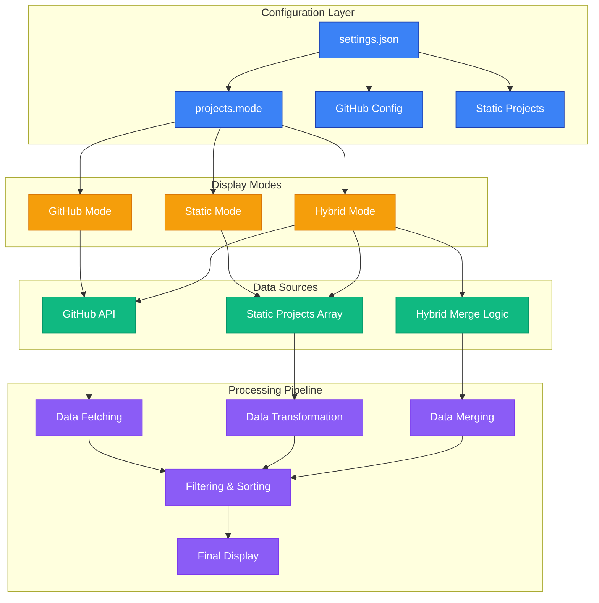
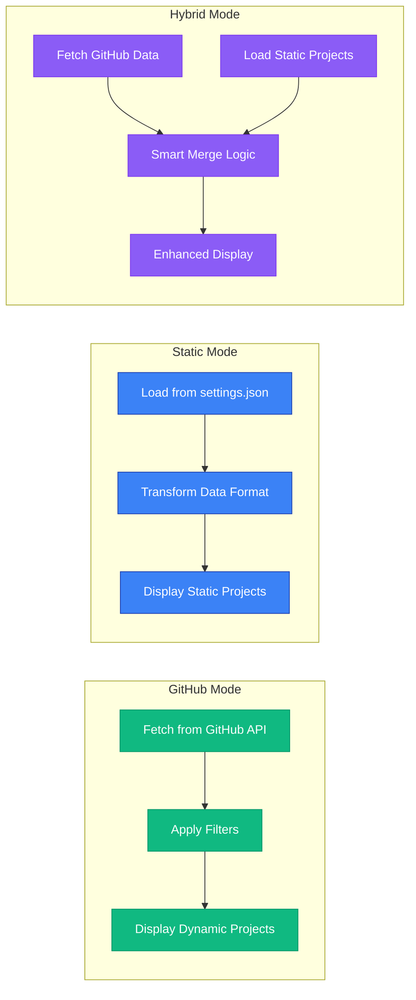
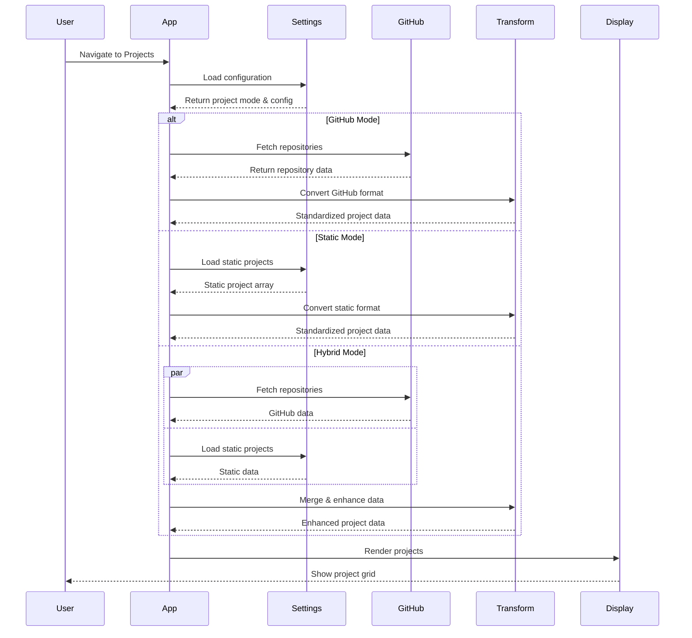

# Projects: Static vs Dynamic vs Hybrid Modes

## 🏗️ Project System Architecture



## 🔄 Project Mode Comparison



## 📊 Data Flow Detailed Diagram



## 🎯 Mode Selection Guide

| **Mode**   | **Best For**                  | **Pros**                                                                 | **Cons**                                                                     |
| ---------- | ----------------------------- | ------------------------------------------------------------------------ | ---------------------------------------------------------------------------- |
| **GitHub** | Developers with active GitHub | ✅ Always up-to-date<br/>✅ No manual maintenance<br/>✅ Rich metadata      | ❌ Limited customization<br/>❌ Requires internet<br/>❌ API rate limits        |
| **Static** | Full control over content     | ✅ Complete customization<br/>✅ Works offline<br/>✅ Stable content        | ❌ Manual updates required<br/>❌ No GitHub integration<br/>❌ More maintenance |
| **Hybrid** | Best of both worlds           | ✅ GitHub convenience<br/>✅ Custom enhancements<br/>✅ Intelligent merging | ❌ More complex setup<br/>❌ Potential conflicts<br/>❌ Higher maintenance      |

## How It Works

### 1. Data Source
- The component now fetches data from `/public/settings.json`
- It reads the `projects.staticProjects` array from the settings file
- If the settings can't be loaded, it shows an error message

### 2. Data Transformation
The component automatically converts the settings.json project format to the expected display format:

```json
// Settings.json format
{
  "id": 1,
  "name": "E-Commerce Platform",
  "description": "A full-stack e-commerce application...",
  "technologies": ["React", "Node.js", "MongoDB"],
  "githubUrl": "https://github.com/...",
  "liveUrl": "https://...",
  "stats": { "stars": 24, "forks": 8 }
}
```

Gets converted to:
```json
// Display format
{
  "id": 1,
  "name": "E-Commerce Platform",
  "description": "A full-stack e-commerce application...",
  "html_url": "https://github.com/...",
  "homepage": "https://...",
  "topics": ["e-commerce", "payment", "full-stack"],
  "language": "React",
  "languages": [
    { "name": "React", "percentage": "65.0", "icon": FaReact, "color": "#61dafb" }
  ],
  "stargazers_count": 24,
  "forks_count": 8
}
```

### 3. Technology Icons & Colors
The component includes automatic mapping for popular technologies:

**Supported Technologies:**
- React, Vue.js, Angular
- Node.js, Express.js
- JavaScript, TypeScript
- MongoDB, PostgreSQL, Redis
- Tailwind CSS, Next.js, Vite
- Python, Java
- And many more...

Each technology gets its appropriate icon and brand color automatically.

### 4. Loading States
- **Loading**: Shows a spinner while fetching data
- **Error**: Shows error message if settings.json can't be loaded
- **Success**: Displays the dynamic project grid

## Configuration

### Adding New Projects
Simply add new project objects to the `staticProjects` array in `settings.json`:

```json
{
  "projects": {
    "staticProjects": [
      {
        "id": 7,
        "name": "New Project",
        "description": "Description of your new project",
        "technologies": ["React", "TypeScript", "Vite"],
        "category": "Frontend",
        "featured": true,
        "status": "Completed",
        "startDate": "2024-01-01",
        "endDate": "2024-06-01",
        "githubUrl": "https://github.com/username/project",
        "liveUrl": "https://project.domain.com",
        "imageUrl": "https://images.unsplash.com/photo-xxx",
        "tags": ["tag1", "tag2", "tag3"],
        "highlights": [
          "Feature 1",
          "Feature 2",
          "Feature 3"
        ],
        "stats": {
          "stars": 10,
          "forks": 3,
          "watchers": 5,
          "issues": 1
        }
      }
    ]
  }
}
```

### Supported Technology Icons
The component automatically detects and assigns icons for these technologies:
- **Frontend**: React, Vue.js, Angular, JavaScript, TypeScript, HTML, CSS
- **Backend**: Node.js, Express.js, Python, Java
- **Databases**: MongoDB, PostgreSQL, Redis
- **Tools**: Vite, Next.js, Tailwind CSS, GitHub Pages
- **And more...**

If a technology isn't recognized, it defaults to a JavaScript icon.

## Features

### Visual Enhancements
- ✅ Dynamic technology icons with brand colors
- ✅ Responsive grid layout
- ✅ Hover animations and transitions
- ✅ Language breakdown visualization
- ✅ GitHub stats display
- ✅ Loading and error states

### Data Features
- ✅ Automatic format conversion
- ✅ Technology icon mapping
- ✅ Fallback handling
- ✅ Random view counters (demo)
- ✅ Date formatting
- ✅ Count formatting (K/M suffixes)

## Usage in App

The component can be used in your routing:

```jsx
import ProjectsStatic from './pages/ProjectsStatic';

// In your router
<Route path="/projects-static" element={<ProjectsStatic />} />
```

## Benefits

1. **No Code Changes**: Add/remove projects via configuration
2. **Consistent Design**: All projects use the same card layout
3. **Technology Recognition**: Automatic icons and colors
4. **Error Handling**: Graceful fallbacks for missing data
5. **Performance**: Efficient data transformation
6. **Maintainable**: Clean separation of data and presentation

## Comparison with Main Projects Component

| Feature      | ProjectsStatic.jsx | Projects.jsx               |
| ------------ | ------------------ | -------------------------- |
| Data Source  | settings.json only | settings.json + GitHub API |
| Mode Support | Static only        | Static + GitHub modes      |
| Complexity   | Simple             | Advanced                   |
| Use Case     | Pure config-based  | Hybrid config/API          |

Choose `ProjectsStatic.jsx` when you want full control over project data through configuration, or `Projects.jsx` when you want the flexibility to switch between static and GitHub API modes.
