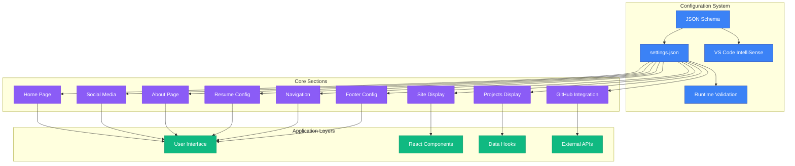
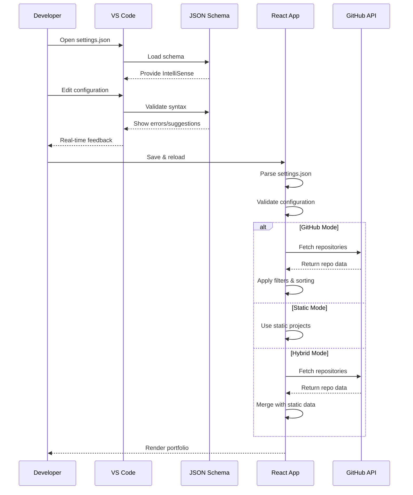
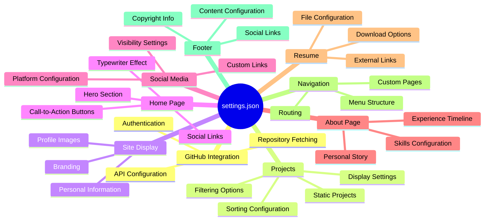
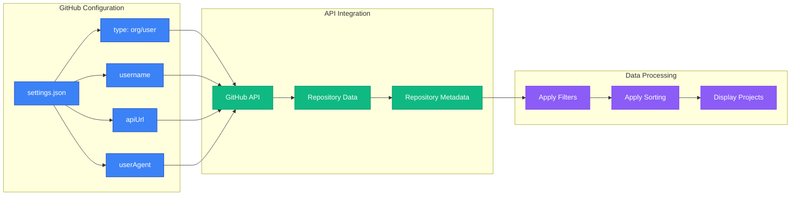
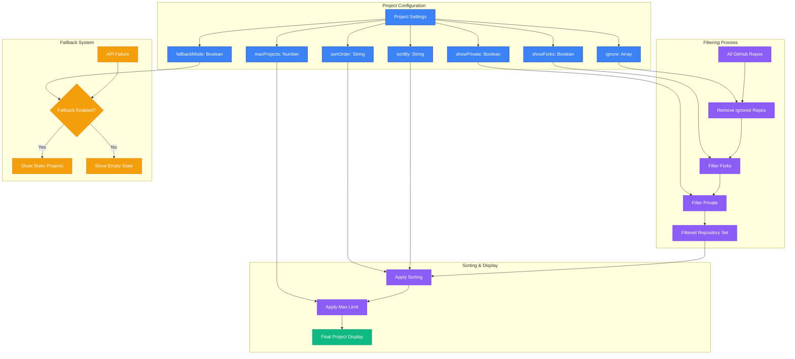

# Settings.json Configuration Guide

This guide provides comprehensive documentation for configuring your portfolio through the `settings.json` file.

## 🏗️ Configuration Architecture



## ⚙️ Configuration Flow



## 📋 Configuration Categories



## 📋 Table of Contents

1. [Getting Started](#getting-started)
2. [GitHub Configuration](#github-configuration)
3. [Project Settings](#project-settings)
4. [Display Configuration](#display-configuration)
5. [Home Page Configuration](#home-page-configuration)
6. [Social Media Configuration](#social-media-configuration)
7. [About Page Configuration](#about-page-configuration)
8. [Resume Configuration](#resume-configuration)
9. [Navigation Configuration](#navigation-configuration)
10. [Footer Configuration](#footer-configuration)
11. [Advanced Configuration](#advanced-configuration)

## 🚀 Getting Started

The `settings.json` file includes JSON Schema support for IntelliSense in VS Code. Simply open the file and start typing to see auto-completion suggestions.

### Schema Reference
```json
{
  "$schema": "./settings.schema.json"
}
```

## 🔗 GitHub Configuration

Configure how your portfolio fetches and displays GitHub repositories.



### Configuration Example
```json
{
  "github": {
    "type": "org",                    // "org" or "user"
    "username": "Life-Experimentalist", // Your GitHub org/username
    "apiUrl": "https://api.github.com/orgs/Life-Experimentalist/repos",
    "userAgent": "VKrishna04-Portfolio" // Custom user agent for API calls
  }
}
```

### Configuration Options
| **Property** | **Type** | **Description**                    | **Example**              |
| ------------ | -------- | ---------------------------------- | ------------------------ |
| `type`       | `string` | API endpoint type: "org" or "user" | `"org"`                  |
| `username`   | `string` | GitHub organization/username       | `"Life-Experimentalist"` |
| `apiUrl`     | `string` | Full GitHub API endpoint URL       | Auto-generated           |
| `userAgent`  | `string` | Custom identifier for API requests | `"Portfolio-v1.0"`       |

## 📊 Project Settings

Control which repositories are displayed and how they're sorted.



### Configuration Example
```json
{
  "projects": {
    "ignore": [                       // Repositories to exclude
      "VKrishna04.github.io",
      ".github",
      "private-repo"
    ],
    "maxProjects": 15,                // Maximum number to display (1-50)
    "sortBy": "updated",              // Sorting criteria
    "sortOrder": "desc",              // Sort direction
    "showForks": false,               // Include forked repositories
    "showPrivate": false,             // Include private repositories
    "fallbackMode": true              // Show fallback if API fails
  }
}
```

### Configuration Options
| **Property**   | **Type**  | **Options**                                   | **Description**                  |
| -------------- | --------- | --------------------------------------------- | -------------------------------- |
| `ignore`       | `array`   | Repository names                              | Exclude specific repositories    |
| `maxProjects`  | `number`  | 1-50                                          | Maximum projects to display      |
| `sortBy`       | `string`  | `"updated"`, `"created"`, `"stars"`, `"name"` | Sort criteria                    |
| `sortOrder`    | `string`  | `"desc"`, `"asc"`                             | Sort direction                   |
| `showForks`    | `boolean` | `true`/`false`                                | Include forked repositories      |
| `showPrivate`  | `boolean` | `true`/`false`                                | Include private repositories     |
| `fallbackMode` | `boolean` | `true`/`false`                                | Enable fallback for API failures |

## 👤 Display Configuration

Basic information displayed across the site.

```json
{
  "display": {
    "officialName": "Krishna GSVV",   // Your full name
    "devUsername": "VKrishna04",      // Your developer handle
    "profileImage": "https://github.com/VKrishna04.png" // Profile image URL
  }
}
```

## 🏠 Home Page Configuration

Comprehensive home page customization.

### Basic Information
```json
{
  "home": {
    "greeting": "Hi There! 👋🏻 I'm",
    "name": "Krishna GSVV",
    "nameGradient": "linear-gradient(to right, #c770f0, #ec4899, #ef4444)",
    "description": "Passionate developer creating innovative solutions..."
  }
}
```

### Typewriter Effect
```json
{
  "home": {
    "typewriterStrings": [
      "Full Stack Developer",
      "Problem Solver",
      "Tech Enthusiast",
      "Open Source Contributor"
    ],
    "animations": {
      "typewriterSettings": {
        "deleteSpeed": 50,            // Speed of text deletion (1-200ms)
        "delay": 100,                 // Delay between characters (1-500ms)
        "autoStart": true,            // Auto-start animation
        "loop": true                  // Loop animation
      }
    }
  }
}
```

### Location Display
```json
{
  "home": {
    "location": {
      "show": true,                   // Whether to show location
      "text": "📍 Bengaluru, India", // Custom location text
      "icon": "📍",                  // Location emoji/icon
      "city": "Bengaluru",           // City name
      "country": "India"             // Country name
    }
  }
}
```

### Profile Image Configuration
```json
{
  "home": {
    "profileImage": {
      "type": "github",              // "github", "display", or "custom"
      "customUrl": "",               // Custom image URL (if type is "custom")
      "altText": "Krishna GSVV",     // Alt text for accessibility
      "borderColor": "border-purple-500/30", // Tailwind border class
      "shadowColor": "shadow-purple-500/20"  // Tailwind shadow class
    }
  }
}
```

### Action Buttons
```json
{
  "home": {
    "buttons": [
      {
        "text": "About Me",           // Button text
        "link": "/about",            // Internal route or external URL
        "type": "primary",           // "primary" or "outline"
        "gradient": "from-purple-600 to-pink-600", // Background gradient
        "hoverGradient": "from-purple-700 to-pink-700", // Hover gradient
        "shadowColor": "shadow-purple-500/25", // Shadow effect
        "icon": "ArrowDownIcon"      // Heroicon name
      },
      {
        "text": "Contact",
        "link": "/contact",
        "type": "outline",           // Outline button style
        "borderColor": "border-purple-500", // Border color
        "textColor": "text-purple-400",     // Text color
        "hoverBg": "hover:bg-purple-500",   // Hover background
        "hoverText": "hover:text-white",    // Hover text color
        "icon": "DocumentArrowDownIcon"
      }
    ]
  }
}
```

### Animation Settings
```json
{
  "home": {
    "animations": {
      "fadeInDuration": 0.6,         // Fade-in duration (0.1-3.0 seconds)
      "staggerDelay": 0.1            // Stagger delay (0.01-1.0 seconds)
    },
    "showScrollIndicator": true      // Show scroll down indicator
  }
}
```

## 📱 Social Media Configuration

Centralized social media management with per-section visibility control.

```json
{
  "social": {
    "platforms": [
      {
        "name": "GitHub",            // Platform display name
        "key": "github",             // Unique identifier
        "icon": "FaGithub",          // React icon component name
        "url": "https://github.com/VKrishna04", // Profile URL
        "label": "GitHub Profile",   // Accessibility label
        "color": "text-white",       // Default color
        "hoverColor": "hover:text-gray-300", // Hover color
        "showInHome": true,          // Show on home page
        "showInFooter": true,        // Show in footer
        "showInContact": true,       // Show on contact page
        "enabled": true              // Enable this platform
      }
    ],
    "contact": {
      "email": "krishnagsvv@gmail.com", // Contact email
      "phone": "",                   // Contact phone (optional)
      "location": "Bengaluru, India" // Contact location
    }
  }
}
```

### Available Social Icons
```
FaGithub, FaLinkedin, FaTwitter, FaInstagram, FaDiscord,
FaYoutube, FaTwitch, FaTiktok, FaMedium, FaDev,
FaStackOverflow, FaDribbble, FaBehance, FaCodepen
```

### Color Examples
```
text-white, text-blue-500, text-purple-400, text-green-500,
text-red-500, text-yellow-400, text-pink-500, text-indigo-500
```

## 📖 About Page Configuration

### Basic Information
```json
{
  "about": {
    "heading": "About Me",
    "subheading": "Get to know me better",
    "title": "I'm Krishna GSVV, a passionate developer",
    "paragraphs": [
      "First paragraph about yourself...",
      "Second paragraph with more details...",
      "Third paragraph about your interests..."
    ]
  }
}
```

### Profile Image
```json
{
  "about": {
    "image": {
      "type": "github",              // "github", "home", or "custom"
      "customUrl": "",               // Custom image URL
      "altText": "Krishna GSVV"      // Alt text
    }
  }
}
```

### Skills Configuration
```json
{
  "about": {
    "skillsHeading": "Technical Skills",
    "skills": [
      {
        "category": "Frontend",       // Skill category name
        "icon": "DevicePhoneMobileIcon", // Category icon
        "items": [
          {
            "name": "React",          // Skill name
            "icon": "FaReact",        // Skill icon
            "color": "text-blue-400"  // Icon color
          },
          {
            "name": "TypeScript",
            "icon": "SiTypescript",
            "color": "text-blue-500"
          }
        ]
      },
      {
        "category": "Backend",
        "icon": "ServerIcon",
        "items": [
          {
            "name": "Node.js",
            "icon": "FaNodeJs",
            "color": "text-green-400"
          }
        ]
      }
    ]
  }
}
```

### Available Category Icons
- `DevicePhoneMobileIcon` - For frontend/mobile
- `ServerIcon` - For backend/server
- `CpuChipIcon` - For tools/DevOps
- `CodeBracketIcon` - For general programming

### Available Skill Icons
```
FaReact, FaNodeJs, FaPython, FaJava, FaGitAlt, FaDocker, FaAws,
SiJavascript, SiTypescript, SiMongodb, SiPostgresql, SiTailwindcss,
SiExpress, SiNextdotjs, SiNestjs, SiRedis, SiGraphql, SiKubernetes,
SiLinux, SiGit, SiFirebase, SiVercel, SiNetlify, and many more...
```

### Statistics Section
```json
{
  "about": {
    "stats": [
      {
        "number": "3+",              // Statistic number
        "label": "Years Experience"  // Statistic label
      },
      {
        "number": "50+",
        "label": "Projects Completed"
      }
    ]
  }
}
```

## 📄 Resume Configuration

### File Serving Options
```json
{
  "resume": {
    "type": "file",                  // "file" or "external"
    "url": "/resume.pdf",            // Local file path
    "filename": "Krishna_GSVV_Resume.pdf", // Download filename
    "alternativeUrl": ""             // External URL (for type "external")
  }
}
```

### Section Ordering
```json
{
  "resume": {
    "sectionOrder": [
      "experiences",
      "skills",
      "education",
      "awards",
      "certifications",
      "personalProjects",
      "publications",
      "languages",
      "volunteerExperience"
    ]
  }
}
```

### Work Experience
```json
{
  "resume": {
    "experiencesHeading": "Work Experience",
    "experiences": [
      {
        "title": "Full Stack Developer",
        "company": "Tech Solutions Inc.",
        "period": "2023 - Present",
        "location": "Remote",
        "description": [
          "Developed web applications using React and Node.js",
          "Collaborated with cross-functional teams",
          "Implemented RESTful APIs"
        ]
      }
    ]
  }
}
```

### Education
```json
{
  "resume": {
    "educationHeading": "Education",
    "education": [
      {
        "degree": "Bachelor of Technology",
        "field": "Computer Science",
        "school": "University of Technology",
        "period": "2018 - 2022",
        "gpa": "3.8/4.0",
        "achievements": [
          "Dean's List for 4 semesters",
          "Computer Science Society President"
        ]
      }
    ]
  }
}
```

### Skills (Resume Format)
```json
{
  "resume": {
    "skillsHeading": "Technical Skills",
    "skills": [
      {
        "category": "Programming Languages",
        "items": [
          {
            "name": "JavaScript",
            "icon": "SiJavascript",
            "color": "text-yellow-400"
          }
        ]
      }
    ]
  }
}
```

### Certifications
```json
{
  "resume": {
    "certificationsHeading": "Certifications",
    "certifications": [
      {
        "name": "AWS Certified Solutions Architect",
        "issuer": "Amazon Web Services",
        "date": "2023",
        "credentialId": "AWS-CSA-2023-001",
        "certificateUrl": "https://www.credly.com/badges/example", // Optional
        "verificationUrl": "https://aws.amazon.com/certification/verify/" // Optional
      }
    ]
  }
}
```

### Personal Projects
```json
{
  "resume": {
    "personalProjectsHeading": "Personal Projects",
    "personalProjects": [
      {
        "name": "E-Commerce Platform",
        "technologies": [
          {
            "name": "React",
            "icon": "FaReact",
            "color": "text-blue-400"
          }
        ],
        "period": "2023",
        "description": "Full-stack e-commerce application...",
        "githubUrl": "https://github.com/example/project", // Optional
        "liveUrl": "https://project-demo.com",             // Optional
        "demoUrl": "https://demo.project.com",             // Optional
        "documentationUrl": "https://docs.project.com"     // Optional
      }
    ]
  }
}
```

### Publications
```json
{
  "resume": {
    "publicationsHeading": "Publications",
    "publications": [
      {
        "title": "Modern Web Development Practices",
        "type": "Article",
        "publisher": "Tech Blog",
        "date": "2023",
        "url": "https://example.com/article",
        "description": "An in-depth analysis of current web development trends"
      }
    ]
  }
}
```

### Languages
```json
{
  "resume": {
    "languagesHeading": "Languages",
    "languages": [
      {
        "name": "English",
        "proficiency": "Native",
        "level": "C2"                // A1, A2, B1, B2, C1, C2
      }
    ]
  }
}
```

### Volunteer Experience
```json
{
  "resume": {
    "volunteerExperienceHeading": "Volunteer Experience",
    "volunteerExperience": [
      {
        "role": "Web Development Mentor",
        "organization": "Code for Community",
        "period": "2022 - Present",
        "description": [
          "Mentored aspiring developers",
          "Conducted weekly workshops"
        ]
      }
    ]
  }
}
```

## 🧭 Navigation Configuration

### Logo Configuration
```json
{
  "navbar": {
    "logo": {
      "type": "text",                // "text", "image", or "github"
      "text": "VK",                   // Logo text
      "name": "Krishna GSVV",        // Full name
      "showName": true,              // Show name with logo
      "showNameOnMobile": false,     // Show name on mobile
      "gradient": "from-primary-500 to-accent-500", // Logo gradient
      "customImageUrl": ""           // Custom image URL
    }
  }
}
```

### Navigation Items
```json
{
  "navbar": {
    "navigation": [
      {
        "name": "Home",              // Display name
        "path": "/"                  // Route path
      },
      {
        "name": "About",
        "path": "/about"
      }
    ]
  }
}
```

### Styling Options
```json
{
  "navbar": {
    "styling": {
      "scrolledBg": "bg-black/80 backdrop-blur-md border-b border-white/10",
      "transparentBg": "bg-transparent",
      "activeColor": "text-primary-400",
      "inactiveColor": "text-white hover:text-primary-400",
      "activeTabGradient": "from-primary-500 to-accent-500",
      "mobileMenuBg": "bg-black/90 backdrop-blur-md"
    }
  }
}
```

## 🦶 Footer Configuration

```json
{
  "footer": {
    "copyright": {
      "name": "Krishna GSVV",        // Copyright holder
      "showYear": true,              // Show current year
      "text": "All rights reserved", // Copyright text
      "customText": ""               // Override default text
    },
    "madeWith": {
      "show": true,                  // Show "made with" section
      "text": "Made with",            // "Made with" text
      "icon": "FaHeart",             // Heart icon
      "iconColor": "text-red-500",   // Icon color
      "by": "VKrishna04"             // Creator name
    },
    "socialLinks": {
      "show": true                   // Show social links in footer
    },
    "styling": {
      "backgroundColor": "bg-gray-900/50 backdrop-blur-sm",
      "borderColor": "border-gray-800/50",
      "textColor": "text-gray-400",
      "copyrightColor": "text-gray-500"
    }
  }
}
```

## ⚙️ Advanced Configuration

### Favicon Settings
```json
{
  "favicon": {
    "type": "github",                // "github", "custom", or "default"
    "customUrl": "",                 // Custom favicon URL
    "sizes": ["16x16", "32x32", "96x96"], // Icon sizes
    "appleTouchIcon": true           // Generate Apple touch icon
  }
}
```

### Counter API (Optional)
```json
{
  "counterAPI": {
    "enabled": true,                 // Enable view counter
    "baseUrl": "https://projectcounter.onrender.com/",
    "timeout": 10000,               // Request timeout (ms)
    "fallbackOnError": true,        // Continue if API fails
    "projectMapping": {
      "autoGenerate": true,         // Auto-generate project mappings
      "customMappings": {}          // Custom project name mappings
    }
  }
}
```

## 🎨 Color and Styling Guide

### Tailwind Color Classes
```css
/* Text Colors */
text-gray-400, text-white, text-purple-400, text-blue-500
text-green-400, text-red-500, text-yellow-400, text-pink-500

/* Background Colors */
bg-purple-600, bg-blue-500, bg-green-400, bg-red-500

/* Gradient Classes */
from-purple-600 to-pink-600
from-cyan-600 to-blue-600
from-green-600 to-blue-600

/* Border Colors */
border-purple-500, border-blue-500, border-gray-800

/* Shadow Effects */
shadow-purple-500/25, shadow-cyan-500/25, shadow-lg
```

### Responsive Breakpoints
```css
/* Default: Mobile first */
/* sm: 640px+ */
/* md: 768px+ */
/* lg: 1024px+ */
/* xl: 1280px+ */
```

## 🚨 Common Mistakes to Avoid

1. **Empty URLs**: Leave empty strings for unused social platforms, don't use invalid URLs
2. **Invalid Icons**: Use only available icon names from the supported libraries
3. **Wrong Color Format**: Use Tailwind classes, not hex codes or CSS colors
4. **Invalid JSON**: Ensure proper comma placement and quote usage
5. **Missing Required Fields**: Check schema requirements for each section

## 🔧 Debugging Tips

1. **Use VS Code**: The JSON schema provides real-time validation
2. **Check Console**: Browser console shows configuration errors
3. **Validate JSON**: Use online JSON validators if needed
4. **Test Incrementally**: Make small changes and test frequently
5. **Use Fallbacks**: Enable fallback modes for external dependencies

---

This comprehensive guide covers all aspects of the `settings.json` configuration. For additional help, check the in section notes in the settings file or refer to the main README.md file.

## 📝 Additional Notes
- Ensure all URLs are valid and accessible.
- Use the provided schema for IntelliSense support in VS Code.
- For any issues, refer to the project's GitHub repository for troubleshooting and support.
- Regularly update your settings to keep your portfolio fresh and relevant.
- Consider contributing to the project by adding new features or improving documentation.
- Follow best practices for web development to ensure your portfolio is performant and accessible.
- Stay updated with the latest web technologies to keep your skills sharp and your portfolio modern.
- Engage with the community by sharing your portfolio and seeking feedback.
