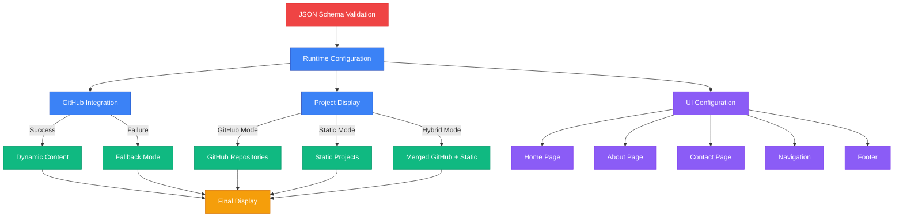

# Settings.json Configuration Reference

## 🎯 Quick Reference Guide

This file provides a quick reference for all configuration options in `settings.json`.

## 🏗️ Configuration Structure Overview

```mermaid
graph TB
    subgraph "Root Configuration"
        Schema["$schema"]
        GitHub[github]
        Projects[projects]
        Display[display]
        Home[home]
        Social[social]
        About[about]
        Resume[resume]
        Nav[navigation]
        Footer[footer]
        Animations[animations]
    end

    subgraph "GitHub Settings"
        GType[type]
        GUser[username]
        GApi[apiUrl]
        GAgent[userAgent]
    end

    subgraph "Project Settings"
        PIgnore[ignore]
        PMax[maxProjects]
        PSort[sortBy]
        POrder[sortOrder]
        PForks[showForks]
        PPrivate[showPrivate]
        PFallback[fallbackMode]
        PMode[mode]
        PStatic[staticProjects]
    end

    subgraph "Home Page Settings"
        HGreeting[greeting]
        HName[name]
        HGradient[nameGradient]
        HTypewriter[typewriterStrings]
        HDesc[description]
        HLocation[location]
        HImage[profileImage]
        HButtons[buttons]
    end

    GitHub --> GType
    GitHub --> GUser
    GitHub --> GApi
    GitHub --> GAgent

    Projects --> PIgnore
    Projects --> PMax
    Projects --> PSort
    Projects --> POrder
    Projects --> PForks
    Projects --> PPrivate
    Projects --> PFallback
    Projects --> PMode
    Projects --> PStatic

    Home --> HGreeting
    Home --> HName
    Home --> HGradient
    Home --> HTypewriter
    Home --> HDesc
    Home --> HLocation
    Home --> HImage
    Home --> HButtons

    classDef root fill:#3b82f6,stroke:#1e40af,color:#fff
    classDef github fill:#10b981,stroke:#059669,color:#fff
    classDef projects fill:#8b5cf6,stroke:#7c3aed,color:#fff
    classDef home fill:#f59e0b,stroke:#d97706,color:#fff

    class Schema,GitHub,Projects,Display,Home,Social,About,Resume,Nav,Footer,Animations root
    class GType,GUser,GApi,GAgent github
    class PIgnore,PMax,PSort,POrder,PForks,PPrivate,PFallback,PMode,PStatic projects
    class HGreeting,HName,HGradient,HTypewriter,HDesc,HLocation,HImage,HButtons home
```



## 📊 Configuration Priority Hierarchy



### 🔗 GitHub Configuration
```json
"github": {
  "type": "org|user",           // Organization or individual user
  "username": "YourName",       // GitHub username or org name
  "apiUrl": "...",             // Auto-generated API endpoint
  "userAgent": "YourApp"       // Custom user agent for requests
}
```

| **Property** | **Type** | **Options**          | **Description**              |
| ------------ | -------- | -------------------- | ---------------------------- |
| `type`       | `string` | `"org"`, `"user"`    | API endpoint type            |
| `username`   | `string` | Any valid username   | GitHub organization/username |
| `apiUrl`     | `string` | Valid GitHub API URL | Repository API endpoint      |
| `userAgent`  | `string` | Custom identifier    | User agent for API requests  |

### 📊 Projects Configuration
```json
"projects": {
  "mode": "github|static|hybrid",  // Project display mode
  "ignore": ["repo1", "repo2"],    // Repositories to exclude
  "maxProjects": 15,               // Maximum projects to show (1-50)
  "sortBy": "updated",             // updated|created|stars|name
  "sortOrder": "desc",             // desc|asc
  "showForks": false,              // Include forked repos
  "showPrivate": false,            // Include private repos
  "fallbackMode": true,            // Show fallbacks if API fails
  "staticProjects": []             // Manual project definitions
}
```

| **Property**   | **Type**  | **Options**                                   | **Description**               |
| -------------- | --------- | --------------------------------------------- | ----------------------------- |
| `mode`         | `string`  | `"github"`, `"static"`, `"hybrid"`            | Project data source           |
| `ignore`       | `array`   | Repository names                              | Exclude specific repositories |
| `maxProjects`  | `number`  | 1-50                                          | Maximum projects to display   |
| `sortBy`       | `string`  | `"updated"`, `"created"`, `"stars"`, `"name"` | Sort criteria                 |
| `sortOrder`    | `string`  | `"desc"`, `"asc"`                             | Sort direction                |
| `showForks`    | `boolean` | `true`, `false`                               | Include forked repositories   |
| `showPrivate`  | `boolean` | `true`, `false`                               | Include private repositories  |
| `fallbackMode` | `boolean` | `true`, `false`                               | Enable API failure fallback   |

### 💻 Display Configuration
```json
"display": {
  "officialName": "Your Full Name",     // Full professional name
  "devUsername": "YourHandle",          // Developer username/handle
  "profileImage": "https://..."         // Profile image URL
}
```

| **Property**   | **Type** | **Description**           | **Example**       |
| -------------- | -------- | ------------------------- | ----------------- |
| `officialName` | `string` | Full professional name    | `"Krishna GSVV"`  |
| `devUsername`  | `string` | Developer handle/username | `"VKrishna04"`    |
| `profileImage` | `string` | Profile image URL         | GitHub avatar URL |

### 📊 Projects Configuration
```json
"projects": {
  "ignore": ["repo1", "repo2"], // Repositories to exclude
  "maxProjects": 15,           // Maximum projects to show (1-50)
  "sortBy": "updated",         // updated|created|stars|name
  "sortOrder": "desc",         // desc|asc
  "showForks": false,          // Include forked repos
  "showPrivate": false,        // Include private repos
  "fallbackMode": true         // Show fallbacks if API fails
}
```

### 🏠 Home Page Configuration
```json
"home": {
  "greeting": "Hi There! 👋🏻 I'm",
  "name": "Your Name",
  "nameGradient": "linear-gradient(...)",
  "typewriterStrings": ["Role 1", "Role 2"],
  "description": "Your description...",
  "location": {
    "show": true,
    "text": "📍 City, Country"
  },
  "profileImage": {
    "type": "github|display|custom",
    "borderColor": "border-purple-500/30",
    "shadowColor": "shadow-purple-500/20"
  },
  "buttons": [
    {
      "text": "Button Text",
      "link": "/path",
      "type": "primary|outline",
      "gradient": "from-purple-600 to-pink-600",
      "icon": "ArrowDownIcon"
    }
  ]
}
```

### 📱 Social Media Configuration
```json
"social": {
  "platforms": [
    {
      "name": "Platform Name",
      "key": "platform_key",
      "icon": "FaPlatform",
      "url": "https://...",
      "color": "text-blue-500",
      "hoverColor": "hover:text-blue-400",
      "showInHome": true,
      "showInFooter": true,
      "showInContact": true,
      "enabled": true
    }
  ]
}
```

### 📖 About Page Configuration
```json
"about": {
  "heading": "About Me",
  "title": "Your title",
  "paragraphs": ["Para 1", "Para 2"],
  "skills": [
    {
      "category": "Category Name",
      "icon": "DevicePhoneMobileIcon",
      "items": [
        {
          "name": "Skill Name",
          "icon": "FaReact",
          "color": "text-blue-400"
        }
      ]
    }
  ],
  "stats": [
    {
      "number": "3+",
      "label": "Years Experience"
    }
  ]
}
```

### 📄 Resume Configuration
```json
"resume": {
  "type": "file|external",
  "url": "/resume.pdf",
  "filename": "Your_Resume.pdf",
  "sectionOrder": ["experiences", "skills", "education"],
  "experiences": [
    {
      "title": "Job Title",
      "company": "Company Name",
      "period": "2023 - Present",
      "location": "Location",
      "description": ["Task 1", "Task 2"]
    }
  ]
}
```

## Available Icons

### Social Media Icons
- `FaGithub`, `FaLinkedin`, `FaTwitter`, `FaInstagram`
- `FaDiscord`, `FaYoutube`, `FaTwitch`, `FaTiktok`
- `FaMedium`, `FaDev`, `FaStackOverflow`
- `FaDribbble`, `FaBehance`, `FaCodepen`

### Technology Icons
- `FaReact`, `FaNodeJs`, `FaPython`, `FaJava`
- `SiJavascript`, `SiTypescript`, `SiMongodb`
- `SiPostgresql`, `SiTailwindcss`, `SiExpress`
- `FaGitAlt`, `FaDocker`, `FaAws`

### Button Icons
- `ArrowDownIcon`, `DocumentArrowDownIcon`

### Category Icons
- `DevicePhoneMobileIcon`, `ServerIcon`
- `CpuChipIcon`, `CodeBracketIcon`

## Color Examples

### Text Colors
```
text-white, text-gray-400, text-purple-400, text-blue-500
text-green-400, text-red-500, text-yellow-400, text-pink-500
```

### Gradients
```
from-purple-600 to-pink-600
from-cyan-600 to-blue-600
from-green-600 to-blue-600
```

### Hover States
```
hover:text-purple-400, hover:bg-blue-500
hover:text-blue-300, hover:text-gray-300
```

## Common Patterns

### Adding a New Social Platform
1. Add to `social.platforms` array
2. Set `enabled: true` and provide `url`
3. Choose appropriate icon from available list
4. Set visibility flags for each section

### Customizing Colors
1. Use Tailwind CSS color classes
2. Format: `text-{color}-{shade}` (e.g., `text-blue-500`)
3. Hover states: `hover:text-{color}-{shade}`

### Adding Resume Sections
1. Add section name to `sectionOrder` array
2. Create corresponding data array (e.g., `experiences`)
3. Include heading field (e.g., `experiencesHeading`)

For complete documentation, see the full [Settings Guide](SETTINGS_GUIDE.md).
